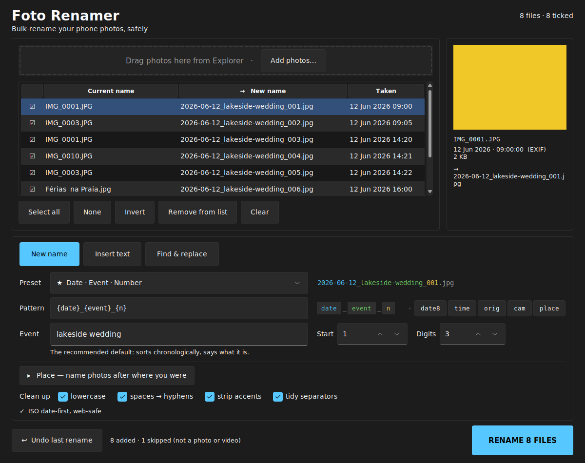
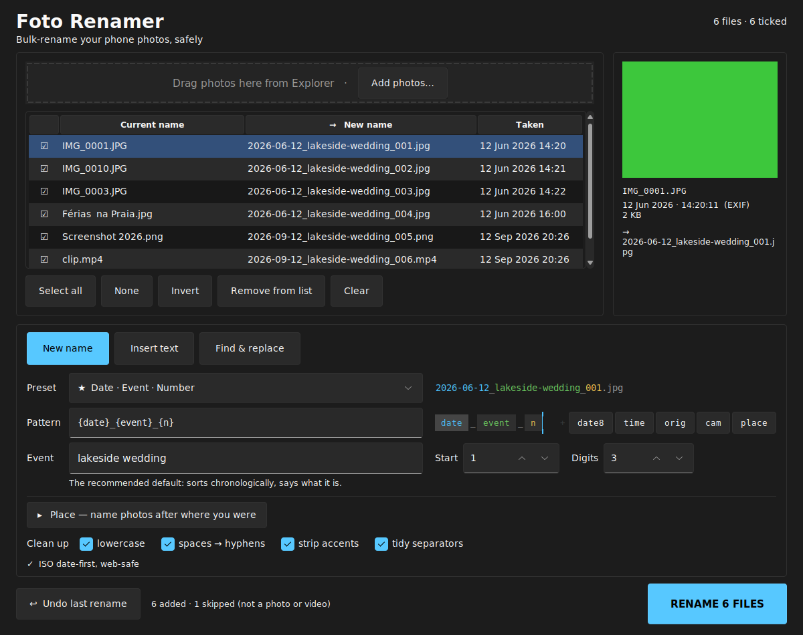

# Foto Renamer

A dark, Windows 11-styled desktop app for bulk-renaming phone photos — with a
live preview of every new name before anything touches disk, and a one-click
undo if you change your mind.



*More views of the app — the other two modes, a custom pattern, the convention
warning, the post-rename state and the long-name guard — are in
[`screenshots/`](screenshots/).*

[](https://github.com/thiagobra/foto-renamer-jua/actions/workflows/tests.yml)
[](LICENSE)

---

## Quick start

1. Install [Python](https://python.org) and tick **"Add python.exe to PATH"**.
2. Download this folder.
3. Double-click **`run.bat`** — it sets everything up the first time, then opens the app.
4. Drag your photos onto the window (or click **Add photos…**).
5. Pick a preset, type the event name, check the preview, hit **RENAME**.

Want a single file you can keep on your desktop? Double-click **`build_exe.bat`**
once and you get `dist\FotoRenamer.exe`, which runs without Python installed.

---

## The three modes

| Mode | What it does | Example |
|---|---|---|
| **New name** | Builds a fresh name from a preset pattern. | `IMG_20260612_142233.jpg` → `2026-06-12_lakeside-wedding_001.jpg` |
| **Insert text** | Keeps the original name, adds text at the beginning, middle or end. | → `IMG_beach_20260612_142233.jpg` |
| **Find & replace** | Swaps part of the existing name. | `IMG` → `holiday` gives `holiday_20260612_142233.jpg` |

In **Insert text** and **Find & replace**, the clean-up switches only tidy *the
text you type* — the rest of the original name is left exactly as it was. In
**New name** the whole name is built by you, so clean-up applies to all of it.

---

## Presets

`{event}` is whatever you type in the Event box. Examples below assume
`lakeside wedding`, a photo taken 12 Jun 2026 at 14:22:33, originally
`IMG_20260612_142233.jpg`.

| Preset | Pattern | Result |
|---|---|---|
| ★ Date · Event · Number | `{date}_{event}_{n}` | `2026-06-12_lakeside-wedding_014.jpg` |
| Date · Event · Number · Camera ID | `{date}_{event}_{n}_{cam}` | `2026-06-12_lakeside-wedding_014_2233.jpg` |
| Date · Number | `{date8}_{n}` | `20260612_014.jpg` |
| Date · Time | `{date}_{time}` | `2026-06-12_14-22-33.jpg` |
| Event · Number | `{event}_{n}` | `lakeside-wedding_014.jpg` |
| Web slug | `{event}-{n}` | `lakeside-wedding-014.jpg` |
| Keep original, add prefix | `{event}_{orig}` | `lakeside-wedding_IMG_20260612_142233.jpg` |
| Keep original, add suffix | `{orig}_{event}` | `IMG_20260612_142233_edit.jpg` |
| Custom… | your own | unlocks the pattern box and the token chips |

### Tokens

| Token | Becomes |
|---|---|
| `{date}` | `2026-06-12` — ISO date, so alphabetical order is chronological order |
| `{date8}` | `20260612` |
| `{time}` | `14-22-33` |
| `{event}` | the Event box |
| `{orig}` | the original file name, without its extension |
| `{cam}` | `2233` — last 4 digits of the original name, traces back to the camera |
| `{n}` | `014` — sequence number, zero-padded to the Digits box |
| `{place}` | `new-york-city` — where you were, from the trip list (see below). Empty for a photo outside every trip, and the separator it would have left is tidied away |

### Putting the tokens in the order you want

Next to the pattern box the pattern is also drawn as blocks — `date _ event _
n` — and **you can drag them into any order you like**. Drop `date` on the end
and the pattern box, the preview and every name in the list follow
immediately. The tokens you are not using sit greyed out after a `+`; click one
to put it on the end, then drag it where it belongs.

The example line above the blocks shows the first ticked photo's finished name
with **each part in its block's colour**, so you can see at a glance which
block put which characters in the name:

<p align="center">
  </p>

Two things worth knowing:

* Only the tokens move. The separators are slots, not luggage, so
  `{date}-{event}_{n}` keeps its hyphen first and its underscore second
  whatever you drag through them, and a literal prefix like the `IMG` in
  `IMG_{date}_{n}` stays put.
* Dragging edits the pattern, so the preset switches itself to **Custom…** —
  but it leaves your four Clean up switches exactly as you set them.

### Naming photos after where you were

Open **Place** under the pattern box and declare the trip once — "15 Sep I was
in New York City, 16–20 Sep Boston" — and every photo picks up its own city
from its own capture date. One rename for the whole folder, instead of one per
city.

| | |
|---|---|
| **City** | Type it once; it joins the dropdown for next time. |
| **From / To** | `YYYY-MM-DD`, plus an optional `HH:MM`. A date on its own means the whole day. An end time runs through the end of that minute, so `18:00` includes the shot at 18:00:30. |
| **Position** | Where `{place}` goes: `Beginning`, `After the date`, `End (suffix)`, or `Off`. It rewrites the pattern box, so you can always see where the place went — and it reads back the other way too, following the block when you drag it. Dragging it somewhere none of those three describe reads as `Custom`. |

Trips may overlap, and **the narrowest one wins**: declare the week in Boston
*and* the afternoon at Fenway Park, and the photos from that afternoon are the
only ones named after the park. A photo outside every trip simply gets no
place, and the name closes up around it — `2026-09-22_lakeside-wedding_007.jpg`,
with no stray underscore.

The trip list is remembered between sessions, and `Off` takes the token back
out of the pattern without forgetting the trips.

---

## Why these patterns

The presets are not invented; they follow what photography and
records-management guidance consistently recommends:

1. **ISO 8601 date first** — alphabetical sort is chronological sort, on every OS.
2. **Zero-pad the sequence** — `007` sorts correctly, `7` does not.
3. **Only `a–z 0–9 - _ .`** — no spaces (they break URLs and scripts), no accents.
4. **`_` separates blocks, `-` separates words** inside a block.
5. **Lowercase** travels better between Windows, web servers and phones.
   (Extensions are *always* lowercased — `.JPG` and `.jpg` are the same file to Windows.)
6. **Keep the camera's last 4 digits** so a renamed file can be traced back to the card.
7. **Consistency beats cleverness** — which is what a preset dropdown is for.

The quiet line under the controls tells you when a name drifts off convention
(`⚠ spaces in name`). It never blocks you.

Sources:
[Tagrly](https://tagrly.com/blog/photo-file-naming-conventions) ·
[Filecamp](https://filecamp.com/blog/file-naming-conventions-for-photographers/) ·
[US National Archives](https://records-express.blogs.archives.gov/2017/08/22/best-practices-for-file-naming/) ·
[FilesDesk](https://filesdesk.app/blog/file-naming-conventions) ·
[For Photographers Only](https://www.forphotographersonly.com/post/photo-file-naming) ·
[UConn Library](https://guides.lib.uconn.edu/c.php?g=832372&p=8226285) ·
[Digital Photography School](https://digital-photography-school.com/tips-for-file-renaming-success-in-lightroom/)

---

## Safety

- **Nothing happens until you press RENAME.** The table is a preview.
- **Undo last rename** reverses the whole batch. Each batch is logged to
  `%LOCALAPPDATA%\FotoRenamer\history\`, so undo still works after a restart.
- Renames happen in two passes via temporary names, so even swapping two names
  (`a.jpg` ⇄ `b.jpg`) can never lose a file.
- If a new name is already taken by a file outside the batch, it gets
  ` (1)`, ` (2)` appended — Explorer's own behaviour. Those rows turn red in the preview.
- Files that can't be renamed (open in another app, read-only) are reported;
  the rest of the batch still completes, and nothing is renamed *onto* the
  file that could not be moved.
- **Names are capped to fit Windows' 260-character path limit.** A very long
  Event name is shortened rather than attempted; those rows turn amber and a
  warning appears under the controls. If the *folder* itself is already too
  deep, the rename is refused with an explanation instead of half-applied.
- **A blocked undo keeps its place in the queue.** If a photo is open in
  another program when you press Undo, that file is reported and the undo
  record is kept, so pressing Undo again once the program is closed finishes
  the job. Only a fully-completed undo retires the record.

## Sorting and dates

Numbering follows **the date the photo was taken**, so a batch numbers
chronologically even if you added the files out of order. Ties fall back to
Explorer-style name order (`IMG_9` before `IMG_10`).

Where that date comes from:

- **Photos** — EXIF, in the order `DateTimeOriginal` (when the shutter fired),
  then `CreateDate` (when it was digitised), then `ModifyDate`. That order
  matters: any editor, and anything that has been through Google Photos,
  WhatsApp or a resize tool, rewrites `ModifyDate`, so a June photo edited in
  September keeps June.
- **Videos** — the `.mp4/.mov/.3gp` container's own date, preferring the
  `©day` string over the movie header's integer. Copying a clip off a phone
  rewrites its file date, so the container is the only place the real one
  survives.
- **Anything with neither** — a screenshot, or a clip with nothing written in
  it — falls back to the file's modified date. The preview pane tells you
  which was used.

Supported: `.jpg .jpeg .png .webp .heic .heif .dng` and `.mp4 .mov .3gp`.
Anything else you drop in is ignored and counted in the status line.

### A note on HEIC/HEIF (iPhone photos)

Pillow cannot open a `.heic` on its own — it needs the **pillow-heif** plugin,
which `requirements.txt` installs for you. With it, HEIC files get their real
capture date and a thumbnail, exactly like a JPEG.

Without it (if you installed the dependencies by hand and skipped it), HEIC
files can still be renamed, but their date falls back to the file's modified
date and no thumbnail is drawn. The app says so in the status line and in the
preview pane rather than quietly using the wrong date. To fix it:
`pip install pillow-heif`.

`.dng` (raw) is renamed and dated from EXIF where present, but never
thumbnailed — decoding raw needs a much heavier dependency than this app wants.

## Keyboard

| Key | Action |
|---|---|
| `Space` | tick / untick the highlighted rows |
| `Delete` | remove the highlighted rows from the list (does not delete files) |
| click the ☐ column | tick / untick one row |

---

## Files

| File | What it is |
|---|---|
| `app.py` | The window — layout, theme, drag & drop, live preview. |
| `renamer.py` | All the naming rules. No GUI code, so it can be tested on its own. |
| `presets.py` | The preset table as plain data — add your own in two lines. |
| `test_renamer.py` | 181 tests for the naming and disk rules. No window needed. |
| `test_packaging.py` | 10 tests for the Windows-only files (CRLF, batch syntax, build flags). |
| `tools/gui_smoke.py` | Opens the real window and drives it. What CI runs. |
| `tools/gui_drive_full.py` | The long manual GUI sweep (122 checks) and the screenshot generator. |
| `tools/bench.py` | Times the live preview, old approach against current. Not run by CI. |
| `make_icon.py` | Regenerates `assets/icon.ico`. |
| `run.bat` / `build_exe.bat` | Run from source / build the standalone exe. |
| `screenshots/` | Pictures of the app running, with an index explaining each one. |
| `.github/workflows/tests.yml` | CI: the unit suite on Windows and Linux, plus a headless GUI run. |

### Running the tests

```
python -m unittest discover -v -p "test_*.py"     # 181 tests, no display needed
xvfb-run -a python tools/gui_smoke.py             # drives the real window (Linux)
python tools\gui_smoke.py                         # the same, on Windows
```

## Troubleshooting

**Drag & drop does nothing** — `tkinterdnd2` didn't install. The app still works
via **Add photos…**; to fix it, run `pip install tkinterdnd2` inside `.venv`.

**The window looks blurry** — that's Windows display scaling. The app asks for
*system* DPI awareness, which Windows applies once at start-up, so restart the
app after changing your scaling setting. On a two-monitor setup with different
scaling factors, the window will look slightly soft on the second monitor;
that is a limit of Tk, which cannot re-scale a window mid-flight.

**HEIC photos show the wrong date** — `pillow-heif` is not installed. Run
`pip install pillow-heif` inside `.venv`, or just delete the `.venv` folder and
let `run.bat` rebuild it.

**"The folder path is too long for Windows"** — Windows refuses any path of 260
characters or more, and the folder your photos are in already uses most of that
before a file name is added. Move the folder closer to the drive root
(`C:\photos\` rather than a deep chain of folders) and try again.

**Undo is greyed out** — there is no batch to undo yet, or the history folder
was cleared.

---

## Licence

[MIT](LICENSE) — do what you like with it.

## Tested on

| | Where | Status |
|---|---|---|
| Logic — 181 unit tests | Windows **and** Linux, Python 3.10 and 3.12 | ✅ green on every push (CI). This includes the rules that only behave like Windows *on* Windows: the 260-character path cap, reserved names (`CON`, `NUL`), and case-only renames such as `IMG_0001.JPG` → `img_0001.jpg`. |
| The real window | Linux, headless | ✅ green on every push (CI), plus an 83-check manual sweep via `tools/gui_drive_full.py` |
| Windows **desktop** behaviour | a real Windows PC | ⚠️ **Not verified.** DPI awareness, the dark title bar, double-clicking `run.bat`, and the PyInstaller `.exe` cannot be exercised by a CI runner with no desktop session. They are reviewed against the Windows API docs and asserted where a file can be asserted (`test_packaging.py` checks the batch files' CRLF endings, block syntax and build flags), but nobody has yet double-clicked `run.bat` on Windows. That is the one remaining gap. |
