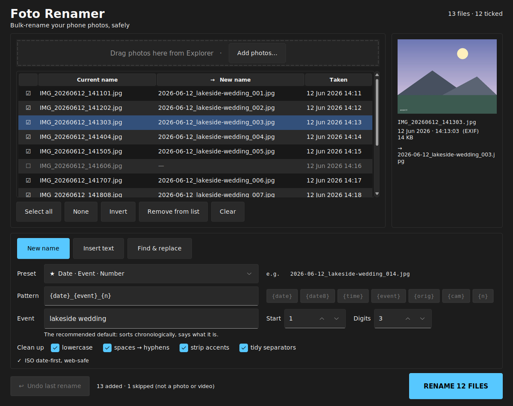

# Foto Renamer

A dark, Windows 11-styled desktop app for bulk-renaming phone photos — with a
live preview of every new name before anything touches disk, and a one-click
undo if you change your mind.

---

## Quick start

1. Install [Python](https://python.org) and tick **"Add python.exe to PATH"**.
2. Download this folder.
3. Double-click **`run.bat`** — it sets everything up the first time, then opens the app.
4. Drag your photos onto the window (or click **Add photos…**).
5. Pick a preset, type the event name, check the preview, hit **RENAME**.

Want a single file you can keep on your desktop? Double-click **`build_exe.bat`**
once and you get `dist\FotoRenamer.exe`, which runs without Python installed.

---

## The three modes

| Mode | What it does | Example |
|---|---|---|
| **New name** | Builds a fresh name from a preset pattern. | `IMG_20260612_142233.jpg` → `2026-06-12_lakeside-wedding_001.jpg` |
| **Insert text** | Keeps the original name, adds text at the beginning, middle or end. | → `IMG_beach_20260612_142233.jpg` |
| **Find & replace** | Swaps part of the existing name. | `IMG` → `holiday` gives `holiday_20260612_142233.jpg` |

In **Insert text** and **Find & replace**, the clean-up switches only tidy *the
text you type* — the rest of the original name is left exactly as it was. In
**New name** the whole name is built by you, so clean-up applies to all of it.

---

## Presets

`{event}` is whatever you type in the Event box. Examples below assume
`lakeside wedding`, a photo taken 12 Jun 2026 at 14:22:33, originally
`IMG_20260612_142233.jpg`.

| Preset | Pattern | Result |
|---|---|---|
| ★ Date · Event · Number | `{date}_{event}_{n}` | `2026-06-12_lakeside-wedding_014.jpg` |
| Date · Event · Number · Camera ID | `{date}_{event}_{n}_{cam}` | `2026-06-12_lakeside-wedding_014_2233.jpg` |
| Date · Number | `{date8}_{n}` | `20260612_014.jpg` |
| Date · Time | `{date}_{time}` | `2026-06-12_14-22-33.jpg` |
| Event · Number | `{event}_{n}` | `lakeside-wedding_014.jpg` |
| Web slug | `{event}-{n}` | `lakeside-wedding-014.jpg` |
| Keep original, add prefix | `{event}_{orig}` | `lakeside-wedding_IMG_20260612_142233.jpg` |
| Keep original, add suffix | `{orig}_{event}` | `IMG_20260612_142233_edit.jpg` |
| Custom… | your own | unlocks the pattern box and the token chips |

### Tokens

| Token | Becomes |
|---|---|
| `{date}` | `2026-06-12` — ISO date, so alphabetical order is chronological order |
| `{date8}` | `20260612` |
| `{time}` | `14-22-33` |
| `{event}` | the Event box |
| `{orig}` | the original file name, without its extension |
| `{cam}` | `2233` — last 4 digits of the original name, traces back to the camera |
| `{n}` | `014` — sequence number, zero-padded to the Digits box |

---

## Why these patterns

The presets are not invented; they follow what photography and
records-management guidance consistently recommends:

1. **ISO 8601 date first** — alphabetical sort is chronological sort, on every OS.
2. **Zero-pad the sequence** — `007` sorts correctly, `7` does not.
3. **Only `a–z 0–9 - _ .`** — no spaces (they break URLs and scripts), no accents.
4. **`_` separates blocks, `-` separates words** inside a block.
5. **Lowercase** travels better between Windows, web servers and phones.
   (Extensions are *always* lowercased — `.JPG` and `.jpg` are the same file to Windows.)
6. **Keep the camera's last 4 digits** so a renamed file can be traced back to the card.
7. **Consistency beats cleverness** — which is what a preset dropdown is for.

The quiet line under the controls tells you when a name drifts off convention
(`⚠ spaces in name`). It never blocks you.

Sources:
[Tagrly](https://tagrly.com/blog/photo-file-naming-conventions) ·
[Filecamp](https://filecamp.com/blog/file-naming-conventions-for-photographers/) ·
[US National Archives](https://records-express.blogs.archives.gov/2017/08/22/best-practices-for-file-naming/) ·
[FilesDesk](https://filesdesk.app/blog/file-naming-conventions) ·
[For Photographers Only](https://www.forphotographersonly.com/post/photo-file-naming) ·
[UConn Library](https://guides.lib.uconn.edu/c.php?g=832372&p=8226285) ·
[Digital Photography School](https://digital-photography-school.com/tips-for-file-renaming-success-in-lightroom/)

---

## Safety

- **Nothing happens until you press RENAME.** The table is a preview.
- **Undo last rename** reverses the whole batch. Each batch is logged to
  `%LOCALAPPDATA%\FotoRenamer\history\`, so undo still works after a restart.
- Renames happen in two passes via temporary names, so even swapping two names
  (`a.jpg` ⇄ `b.jpg`) can never lose a file.
- If a new name is already taken by a file outside the batch, it gets
  ` (1)`, ` (2)` appended — Explorer's own behaviour. Those rows turn red in the preview.
- Files that can't be renamed (open in another app, read-only) are reported;
  the rest of the batch still completes.

## Sorting and dates

Numbering follows **the date the photo was taken**, read from EXIF, so a batch
numbers chronologically even if you added the files out of order. Videos and
screenshots have no EXIF, so their file date is used instead; the preview pane
tells you which was used. Ties fall back to Explorer-style name order
(`IMG_9` before `IMG_10`).

Supported: `.jpg .jpeg .png .webp .heic .heif .dng` and `.mp4 .mov .3gp`.
Anything else you drop in is ignored and counted in the status line.

## Keyboard

| Key | Action |
|---|---|
| `Space` | tick / untick the highlighted rows |
| `Delete` | remove the highlighted rows from the list (does not delete files) |
| click the ☐ column | tick / untick one row |

---

## Files

| File | What it is |
|---|---|
| `app.py` | The window — layout, theme, drag & drop, live preview. |
| `renamer.py` | All the naming rules. No GUI code, so it can be tested on its own. |
| `presets.py` | The preset table as plain data — add your own in two lines. |
| `test_renamer.py` | 44 tests. Run: `python -m unittest test_renamer -v` |
| `make_icon.py` | Regenerates `assets/icon.ico`. |
| `run.bat` / `build_exe.bat` | Run from source / build the standalone exe. |

## Troubleshooting

**Drag & drop does nothing** — `tkinterdnd2` didn't install. The app still works
via **Add photos…**; to fix it, run `pip install tkinterdnd2` inside `.venv`.

**The window looks blurry** — that's Windows scaling; the app asks for
per-monitor DPI awareness, which needs a restart of the app after changing
display scaling.

**Undo is greyed out** — there is no batch to undo yet, or the history folder
was cleared.
